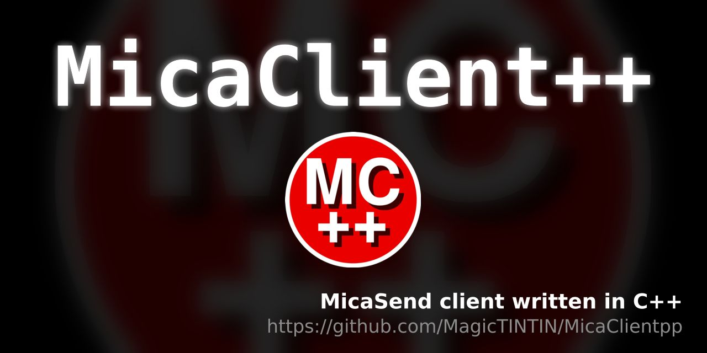

# MicaClient++
A simple client for Micasend written in C++
<br>
# Installation
To compile it you will need to first install the dependencies:<br>
- Ubuntu: `sudo apt install g++ libcurl4-openssl-dev`
- Arch Linux: `sudo pacman -S curl`
<br>
Then you juste need to run `./compile` in your local folder.

# How to use it
## Setup
First, set settings like username, token... in `config.json`.<br>
## Basic usage
Then, you can run `./MicaClient`, and now you should see the chat.<br>
<br>
To send a message: just type it, and press Enter !<br>
## Reply to a message
To reply to a message type `/r x` *(with x the message ID to reply)*.<br>
If you don't know it, only type `/r`, then choose the ID of the message you want to reply<br>
Then, press [ENTER], and you will be able to write and send your answer !

## Secure/Unsecure mode
By defalut, encryption message is active (you can see that messages are encrypted when there is a **S** on green background), but if you want to send a message in unsecure mode (message will be sent without encryption), you can type `/u Unsecure message`.
<br>
To reply in unsafe mode, type `/ru x` or `/ru`<br>
<br>
You can also disable it in config.json, but it is not recommanded.<br>
If you disable "enableEncryption" you won't be able to read Secured messages nor using private groups.<br>

## Private groups
You can create private groups that will only be readable by some users.
### Create a group
To create a group, in config.json just add a new object to discussionGroupKeys section like in the example below:<br>
```json
"discussionGroupKeys": {
    "a":{
        "users": [ "MagicTest", "Michel" ],
        "key":"thisIsAPrivateGroup"
    }
},
```
In this example the group is named "a" and its associated key is "thisIsAPrivateGroup".<br>
**Groups should not have spaces in their name !**
<br>
> /!\\ Several users can create groups with the same name /!\\<br>
As you might not have the same key, you will see encrypted message from users that are not in your group.<br>
> - So to be sure private message are coming from the right group you must **add** the users that belong to your group.
> - To receive messages from everyone in this group, add "*" in "users"<br>
<br>
Then, just communicate the name and the key of the group you created to your members, and ask them to complete the "users" section too.<br>
<br>
To filter message by group type `/g groupname`, and to go back to general `/g`.<br>
Be careful, if you are in a group channel and you send a message, it will only be sent to the group.
<br>

### Send a message in private group
To send a message in a private group, just type `/p groupname` or `/p` and then type the group name.
Then just type your message and press [ENTER].
If you reply to a message of a group, it will automatically reply in the group.

## Command list
- `/help, /h` to print a message containing all the commands available.<br>
- `/exit, /q` to exit MicaClient++
- `/u` to send a message in unsafe mode.
- `/r, /ru` to reply to a message (ru for unsafe mode)
- `/p` to send a message in a group
- `/g` to change group vision (channel)
<br>
## Arguments
You can start MicaClient++ with arguments !
- `-m, --moderator` enables **moderator view** to get messages ID (no you won't have rights to delete messages :p)
- `--cfg path/to/a/config/file.json` to load other config (usefull when you have several accounts)

## config.json and Settings
There are many more settings available in config.json
```json
// to only see messages sent by verified users
"blockUnVerifiedUsers":false,
// to block specific users
"blockedUsers": [ "blockedPseudo", "blockedPseudo2" ],
```
You can also block users in discussion groups (for instance in public groups where someone try to chat in your group with a wrong key)
```json
"public":{
    "users": [ "*" ],
    "blocked": [ "blockedPseudoInPublicGroup" ],
    "key":"thisIsaPublicGroup"
}
```

In config.json you have a section named "settings" :
```json
"settings": {
    // to memorise old messages that are not available on the server anymore
    "backupMessages":true, 
    // to show date and hour (french time zone) at which the message has been posted
    "showMessageDateTime":true,
    // to show messages that have been deleted by moderator (from cache/backup)
    "displayDeletedMessages":true,
    // to show messages that are not available on the server anymore (from cache/backup)
    "displayOfflineMessages":true
}
```
---
# Futures features : 
- Themes : MicaClient++, Original (copy of micasend official client)  
- add /game with megamorpion implementation (submenus with /showgame /play /addgame /delgame)
- add /adduser for admins (with /showuser /upuser)